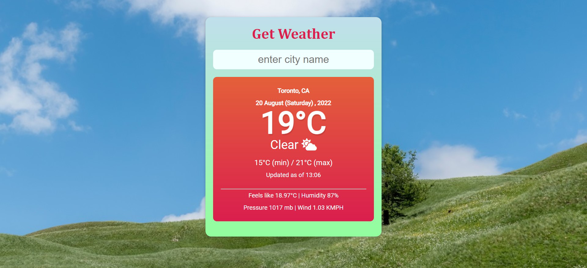
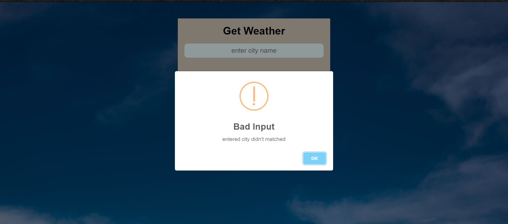

# Weather Web App

## I used open weather API to fetch data 

https://aditi-gulati.github.io/Weather/

### Features of the project.

* It provides dynamic weather data like temp, min max temp, etc.
* Dynamic background images change according to weather status.
* Dynamic weather icon changes according to weather status.
* It provides basic information like feels like temperature, humidity, pressure, and wind speed.
* It will not accept empty input.
* It will give you  an alert if the city name does not match with API data.
* a good  UX/UI 

### Snapshot

* Default 

* When you entered any valid city
 

* when you didn't entered anything 
 

* when entered city didn't matched with data
 

